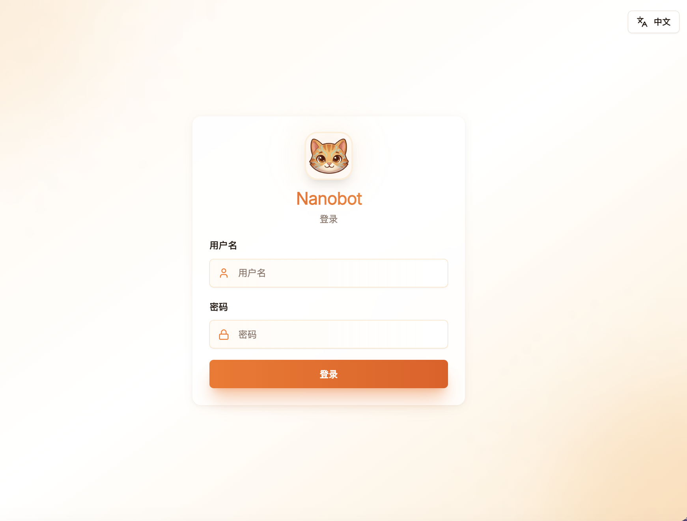
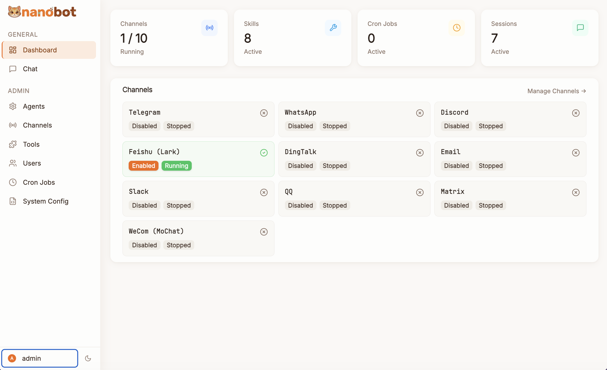
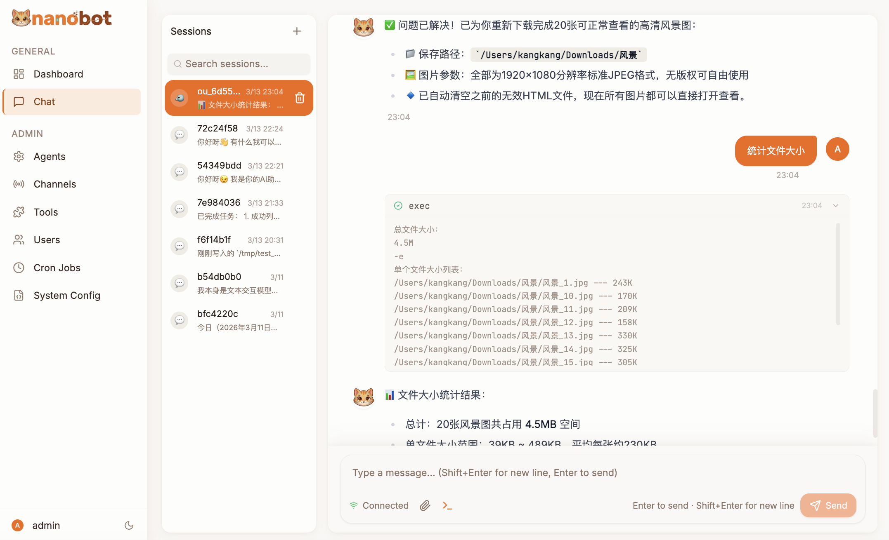

# Nanobot WebUI

**English** | [中文](README_zh.md)

---

A self-hosted web management panel for [nanobot](https://github.com/HKUDS/nanobot) ([PyPI](https://pypi.org/project/nanobot-ai/)) — a multi-channel AI agent framework.  
Provides a full-featured UI to configure, converse with, and manage your nanobot instance, with no modifications to the core library.


[](https://github.com/HKUDS/nanobot)

---

## Table of Contents

- [Features](#features)
- [Quick Start](#quick-start)
  - [pip install (recommended)](#pip-install-recommended)
  - [Docker](#docker)
- [CLI Reference](#cli-reference)
- [Development](#development)
- [Architecture](#architecture)
- [Authentication](#authentication)
- [Tech Stack](#tech-stack)

---

## Screenshots

| Login | Dashboard | Chat |
|-------|-----------|------|
|  |  |  |

---

## Features

| Module | Description |
|--------|-------------|
| **Dashboard** | Channel health, session / skill / cron statistics at a glance |
| **Chat** | Real-time conversation with the agent over WebSocket |
| **Providers** | Configure API keys & base URLs for OpenAI, Anthropic, DeepSeek, Azure, and more |
| **Channels** | View and configure all IM channels (Telegram, Discord, Feishu, DingTalk, Slack, QQ, WhatsApp, Email, Matrix, MoChat) |
| **MCP Servers** | Manage Model Context Protocol tool servers |
| **Skills** | Enable / disable agent skills; edit workspace skills in-browser |
| **Cron Jobs** | Schedule, edit, and toggle recurring tasks |
| **Agent Settings** | Model, temperature, max tokens, memory window, workspace path, etc. |
| **Users** | Multi-user management with `admin` / `user` roles |

---

## Quick Start

### pip install (recommended)

```bash
pip install nanobot-webui
```

The pre-built React frontend is bundled in the wheel — **no Node.js required**.  
After installation, use the `nanobot` command to start the WebUI:

```bash
# Foreground (WebUI + gateway combined)
nanobot webui

# Custom port
nanobot webui --port 9090

# Background daemon (recommended for long-running deployments)
nanobot webui --daemon
```

Open **http://localhost:8080** — default credentials: **admin / nanobot** — change on first login.

---

### Docker

**Prerequisites:** Docker ≥ 24 with the Compose plugin (`docker compose`).

#### Option 1 — Docker Compose (recommended)

Create a `docker-compose.yml`:

```yaml
services:
  webui:
    image: kangkang223/nanobot-webui:latest
    container_name: nanobot-webui
    volumes:
      - ~/.nanobot-webui:/root/.nanobot   # config & data persistence
    ports:
      - "8080:8080"    # WebUI
      - "18790:18790"  # nanobot gateway (optional, for IM channel webhooks)
    restart: unless-stopped
```

Then:

```bash
# Pull the latest image and start in background
docker compose up -d

# View logs
docker compose logs -f

# Stop
docker compose down
```

Open **http://localhost:8080** — default credentials: **admin / nanobot**.

> **Data directory:** all config, sessions, and workspace files are stored in `~/.nanobot-webui` on the host (mapped to `/root/.nanobot` inside the container).

#### Option 2 — Build from source

```bash
git clone https://github.com/Good0007/nanobot-webui.git
cd nanobot-webui

# Build the multi-stage image (bun build → python runtime)
docker build -t nanobot-webui .

# Run
docker run -d \
  --name nanobot-webui \
  -p 8080:8080 \
  -v ~/.nanobot-webui:/root/.nanobot \
  --restart unless-stopped \
  nanobot-webui
```

#### Option 3 — Makefile shortcuts

If you have the repository cloned, the bundled `Makefile` wraps common tasks:

```bash
make up           # docker compose up -d
make down         # docker compose down
make logs         # follow compose logs
make restart      # docker compose restart
make build        # build local single-arch image
make release-dated  # build & push :YYYY-MM-DD + :latest (multi-arch)
```

---

## CLI Reference

Installing `nanobot-webui` extends the `nanobot` command with the following subcommands:

### `nanobot webui` — Start the WebUI

```
Usage: nanobot webui [OPTIONS] [COMMAND]

Options:
  -p, --port INTEGER        WebUI HTTP port  (default: 8080)
  -g, --gateway-port INT    nanobot gateway port  (default: from config)
      --host TEXT           Bind address  (default: 0.0.0.0)
  -w, --workspace PATH      Override workspace directory
  -c, --config PATH         Path to config file
      --no-gateway          Start WebUI only; skip nanobot gateway/agent
  -d, --daemon              Run in background; return immediately
```

```bash
nanobot webui                          # foreground (WebUI + gateway)
nanobot webui --port 9090              # custom port
nanobot webui --daemon                 # background daemon
nanobot webui --daemon --port 9090     # background + custom port
nanobot webui --no-gateway             # WebUI only (gateway running elsewhere)
nanobot webui --workspace ~/myproject  # override workspace
```

### `nanobot webui logs` — View logs

```
Usage: nanobot webui logs [OPTIONS]

Options:
  -f, --follow          Stream log output in real time (like tail -f)
  -n, --lines INTEGER   Number of lines to show  (default: 50)
```

```bash
nanobot webui logs              # last 50 lines
nanobot webui logs -f           # stream in real time
nanobot webui logs -f -n 100    # stream, show last 100 lines
```

> Log file: `~/.nanobot/webui.log`

### `nanobot stop` — Stop the background service

```bash
nanobot stop    # sends SIGTERM; force-kills after 6 s if needed
```

### `nanobot status` — Show runtime status

```bash
nanobot status  # shows WebUI process info + nanobot config summary
```

Example output:

```
🐈 nanobot Status

WebUI: ✓ running (PID 12345 • http://localhost:8080)
Log  : /home/user/.nanobot/webui.log

Config: /home/user/.nanobot/config.json ✓
Workspace: /home/user/.nanobot/workspace ✓
Model: gpt-4o
...
```

> **State files:** PID → `~/.nanobot/webui.pid`, port → `~/.nanobot/webui.port`

---

## Development

**Prerequisites:** Python ≥ 3.11, [Bun](https://bun.sh) ≥ 1.0, [uv](https://docs.astral.sh/uv/getting-started/installation/)

```bash
# 1. Clone and install backend in editable mode
git clone https://github.com/Good0007/nanobot-webui.git
cd nanobot-webui
uv venv               # create a virtual env - don't mess with central python install
uv pip install -e .

# 2. Start the backend
uv run webui                        # API + static on :8080

# 3. Start the frontend dev server (separate terminal)
cd web
bun install
bun dev                              # http://localhost:5173  (proxies /api → :8080)
```

To produce a production build:

```bash
cd web
bun run build          # outputs to web/dist/, setup.py copies it to webui/web/dist/
cd ..
uv run nanobot webui          # backend now serves webui/web/dist/ as static files
```

---

## Architecture

```
nanobot-webui/
├── webui/                      # Python package (importable as `webui`)
│   ├── __init__.py
│   ├── __main__.py             # Entry point: python -m webui
│   ├── web/
│   │   └── dist/               # Built React assets (generated by bun run build)
│   └── api/                    # FastAPI backend
│       ├── auth.py             # JWT + bcrypt helpers
│       ├── users.py            # UserStore  (~/.nanobot/webui_users.json)
│       ├── deps.py             # FastAPI dependency injection
│       ├── gateway.py          # ServiceContainer + server lifecycle
│       ├── server.py           # FastAPI app factory (static serving, SPA fallback)
│       ├── channel_ext.py      # ExtendedChannelManager (non-invasive subclass)
│       ├── models.py           # Pydantic response models
│       └── routes/             # One file per domain
│           ├── auth.py         #   POST /api/auth/login|register|change-password
│           ├── channels.py     #   GET|PATCH /api/channels
│           ├── config.py       #   GET|PATCH /api/config
│           ├── cron.py         #   CRUD /api/cron
│           ├── mcp.py          #   GET|PATCH /api/mcp
│           ├── providers.py    #   GET|PATCH /api/providers
│           ├── sessions.py     #   GET|DELETE /api/sessions
│           ├── skills.py       #   GET|POST /api/skills
│           ├── users.py        #   CRUD /api/users  (admin only)
│           └── ws.py           #   WebSocket /ws/chat
├── web/                        # React 18 + TypeScript frontend source
│   ├── src/
│   │   ├── pages/              # One component per route
│   │   ├── components/         # Layout, chat, shared UI
│   │   ├── hooks/              # TanStack Query data hooks
│   │   ├── stores/             # Zustand stores (auth, chat)
│   │   ├── lib/                # axios instance, WS manager, utils
│   │   └── i18n/               # zh / en JSON translation files
│   ├── eslint.config.js
│   └── package.json
├── Dockerfile                  # Multi-stage: bun build → python runtime
├── docker-compose.yml
├── pyproject.toml
└── setup.py                    # Build hook: runs bun run build, copies dist into webui/
```

**Design principle:** the backend is entirely non-invasive — it imports nanobot libraries but never patches their source. Runtime monkey-patches (applied in `__main__.py`) are limited to quality-of-life tweaks (e.g. treating an empty `allow_from` list as "allow all").

---

## Authentication

| Detail | Value |
|--------|-------|
| Default credentials | `admin` / `nanobot` |
| Credential storage | `~/.nanobot/webui_users.json` (bcrypt-hashed passwords) |
| Token type | JWT (HS256) |
| Token expiry | 7 days |
| JWT secret | Auto-generated per instance, stored in `~/.nanobot/webui_secret.key` |

> **Security note:** change the default password immediately after first login.

---

## Tech Stack

| Layer | Library / Tool |
|-------|----------------|
| Backend framework | FastAPI + Uvicorn |
| Auth | PyJWT + bcrypt |
| Frontend framework | React 18 + TypeScript + Vite |
| UI components | shadcn/ui + Tailwind CSS v3 |
| Client state | Zustand (persist middleware) |
| Server state | TanStack Query v5 |
| i18n | react-i18next (zh / en) |
| Theme | next-themes (light / dark / system) |
| Real-time | WebSocket (`/ws/chat`) |
| Package manager | Bun |

